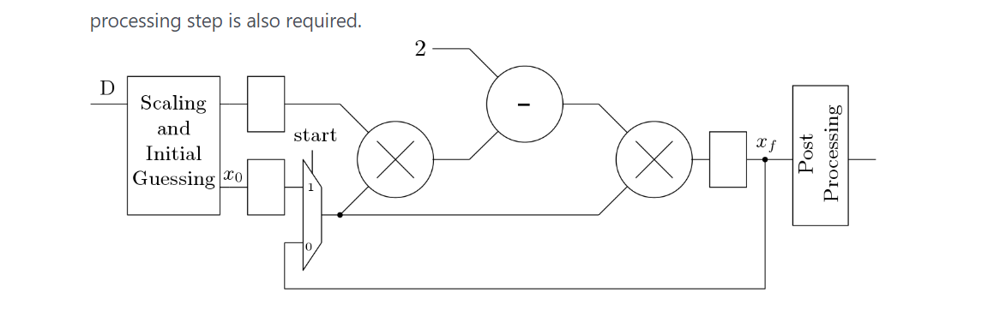
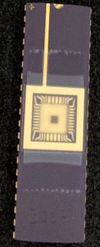

# Gauss_Seidal_Iteration_Machine
## Solving Simultaneous Equations and Inverse Matrices on Gauss-Seidel Iteration Machine Acceleration Chip
* Final Project from NTUEE IC Design laboratory
* CHIP is taped out by TSMC  
* (02_SYN and 04_APR are files for EDA tools, and they are not uploaded)
* ### Please check out Report.pdf for detailed information !!
## CHIP

## Reciprocal

## Core
  
## Final layout

## Tapeout

